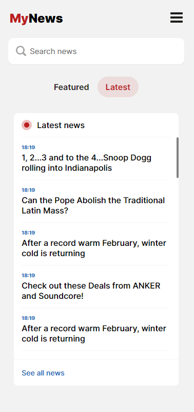
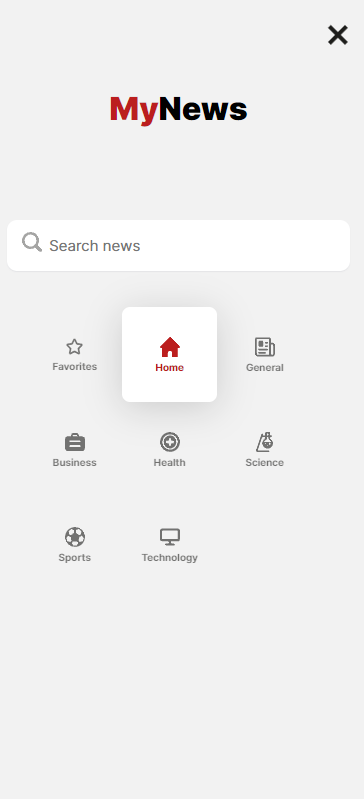

# News app

This is a simple news app where you can see the top news and latest news from all around the world.
Also, you can filter news by categories and article names.
Application is built using React.js, SASS, Typescript, and libraries like react-query, react router.

## Getting started

Prerequisite: Node Package Manager (npm) download can be found <a href="https://nodejs.org/en/download/">here</a>.

1. Clone this repository `git clone https://github.com/akrzelj-ossunist/news-app`

2. `npm install` to install all required dependencies.

3. For this app to work you have to rename .env.example to .env file. Inside you have to paste api key that you can get only by creating account <a href="https://newsapi.org">here</a>.

4. `npm start` to start the application. As you make changes the website will be automatically reloaded.

5. `localhost:3000` to see the app you have to go to this website.

## Libraries and custom hooks used for this app

<a href="https://react-query-v3.tanstack.com/overview">React-query</a>
-Used for easier fetching data and cleaner code.

<a href="https://reactrouter.com/en/main">React-router</a>
-Used for routing through pages.

<a href="https://usehooks-ts.com/react-hook/use-intersection-observer">useIntersectionObserver</a>
-Used for checking if a document object is shown on screen. If it does, we fetch new data.

<a href="https://usehooks.com/useDebounce/">useDebounce</a>
-Used for the search part where we don't want to automatically search for data,
we search but wait for half a second for that to happen,because we wanna reduce api calls to a minimum.

## Screenshots

Home:

